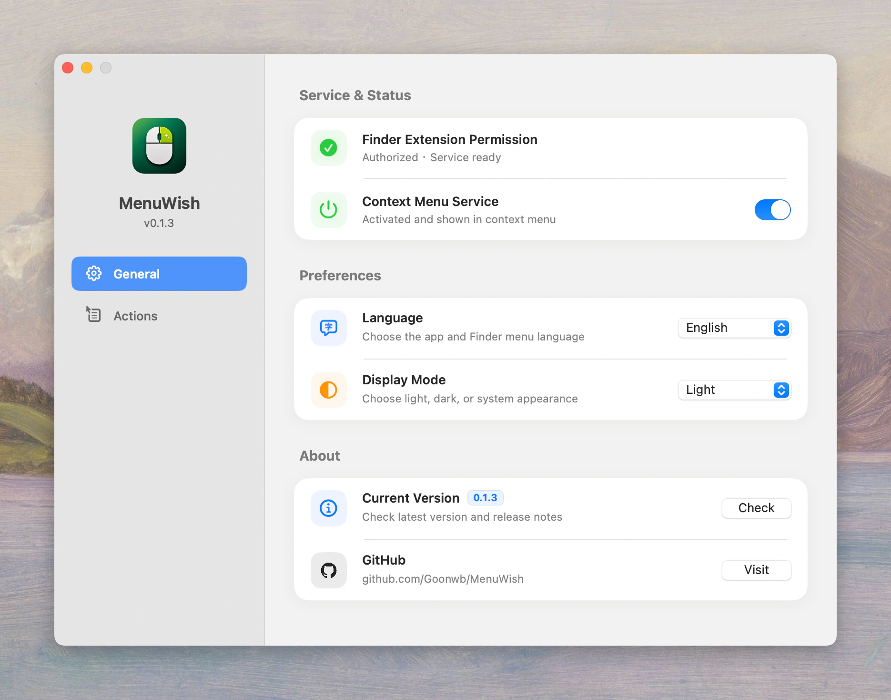
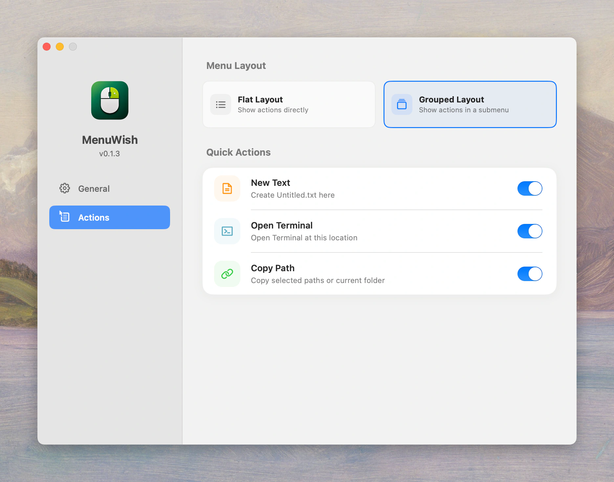

<p align="center">
  
</p>

<h1 align="center">MenuWish</h1>

<p align="center">
  <strong>Make your Finder right-click as you wish.</strong>
</p>

<p align="center">
  A lightweight macOS extension for New Text, Terminal &amp; Copy Path.
</p>

<p align="center">
  <strong>中文：</strong>轻量开源的 Mac Finder 菜单增强：新建文本、进入终端、拷贝路径。
</p>

<p align="center">
  <a href="README.md">English</a>
  |
  <a href="README.zh-CN.md">中文</a>
</p>

<p align="center">
  <a href="LICENSE">MIT License</a>
  ·
  <a href="https://github.com/Goonwb">Author</a>
</p>

## Why MenuWish?

Finder does not include a direct **New Text File** action in its context menu, while opening the current folder in Terminal or copying a full path often takes extra steps. MenuWish adds these focused shortcuts directly to the macOS Finder right-click menu through a native Finder Sync extension.

## Features

MenuWish keeps the Finder context menu focused on three everyday actions:

- **New Text**: create an empty `Untitled.txt` in the current Finder folder. Duplicate names are numbered automatically.
- **Open Terminal**: open Terminal at the current Finder location.
- **Copy Path**: copy selected item paths, or copy the current folder path when nothing is selected.

The app supports:

- A master switch for the Finder context menu.
- Individual switches for each action.
- Optional grouped submenu display.
- Manual update checking from GitHub Releases.
- Language support: follows the system, with Simplified Chinese, Traditional Chinese, and English localization.
- Appearance selection: System, Light, or Dark.

## Screenshots

<p align="center">
  
</p>

<p align="center">
  
</p>

## Requirements

- macOS 13.0 or later
- Xcode 15 or later for building from source

## Install From Source

```zsh
chmod +x Scripts/install-local.sh
./Scripts/install-local.sh
```

The script builds the Release app, copies it to `/Applications`, registers the Finder extension, and restarts Finder.

## Build Manually

```zsh
xcodebuild \
  -project RightMenuMini.xcodeproj \
  -scheme RightMenuMini \
  -configuration Release \
  -derivedDataPath build \
  build

open build/Build/Products/Release/RightMenuMini.app
```

## First-Time Permission

MenuWish uses Apple's Finder Sync extension mechanism. macOS requires users to enable Finder extensions manually:

1. Open MenuWish.
2. Click **Authorize**.
3. Enable **MenuWish** in the **File Provider** extension sheet.

Before permission is granted, all switches are shown as off and disabled. After permission is enabled, the app restores the default or saved settings.

## Notes

- Current version: `0.1.3`.
- The distributed app is not notarized yet. Users may need to allow it manually in macOS security settings.

## License

MenuWish is released under the [MIT License](LICENSE).
