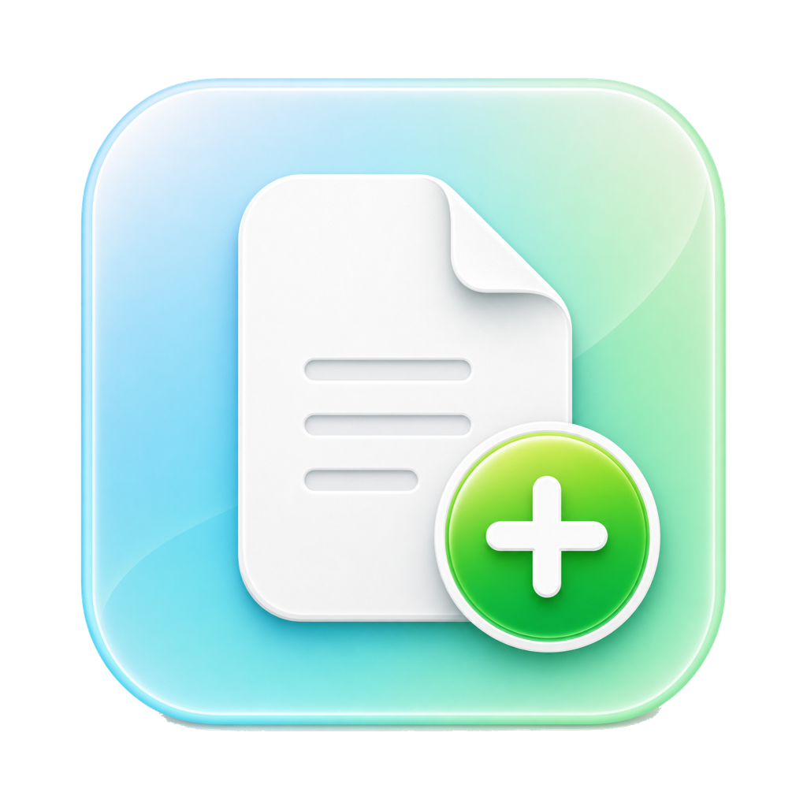

<p align="center">
  
</p>

<h1 align="center">右键菜单助手</h1>

<p align="center">
  <strong>RightMenuMini</strong> is a small macOS Finder extension that adds a few practical actions to the right-click menu.
</p>

<p align="center">
  <a href="LICENSE">MIT License</a>
  ·
  <a href="https://github.com/Goonwb">Author</a>
</p>

## Features

RightMenuMini keeps the Finder context menu focused on three everyday actions:

- **New Text File**: create an empty `Untitled.txt` in the current Finder folder. Duplicate names are numbered automatically.
- **Open Terminal Here**: open Terminal at the current Finder location.
- **Copy Path**: copy selected item paths, or copy the current folder path when nothing is selected.

The app also provides simple preferences:

- Enable or disable the whole Finder menu.
- Enable or disable each action individually.
- Show actions directly in the Finder menu, or collapse them into a submenu.

## Requirements

- macOS 13.0 or later
- Xcode 15 or later for building from source

## Install From Source

Clone the repository, then run the local install script:

```zsh
chmod +x Scripts/install-local.sh
./Scripts/install-local.sh
```

The script builds the Release app, copies it to `/Applications`, registers the Finder extension, and restarts Finder.

## Build Manually

```zsh
xcodebuild \
  -project RightMenuMini.xcodeproj \
  -scheme RightMenuMini \
  -configuration Release \
  -derivedDataPath build \
  build

open build/Build/Products/Release/RightMenuMini.app
```

## First-Time Permission

RightMenuMini uses Apple's Finder Sync extension mechanism. macOS requires users to enable Finder extensions manually:

1. Open RightMenuMini.
2. Click **初次授权**.
3. Enable **右键菜单助手** in the **文件提供程序** extension sheet.

After the extension is enabled, the right-click menu works without keeping the main app window open.

## Updating

macOS cannot replace an app bundle while it is running. Before replacing an older copy in `/Applications`, quit RightMenuMini from the menu bar.

The local install script also tries to quit old app and extension processes before copying the new build.

## Notes

- RightMenuMini is a personal utility in early development. Current version: `0.1.0`.
- The distributed app is not notarized. When sharing builds with others, they may need to allow the app manually in macOS security settings.
- The generated zip in `dist/` is intentionally ignored by Git. Release archives should be uploaded through GitHub Releases instead of committed to the repository.

## License

RightMenuMini is released under the [MIT License](LICENSE).
