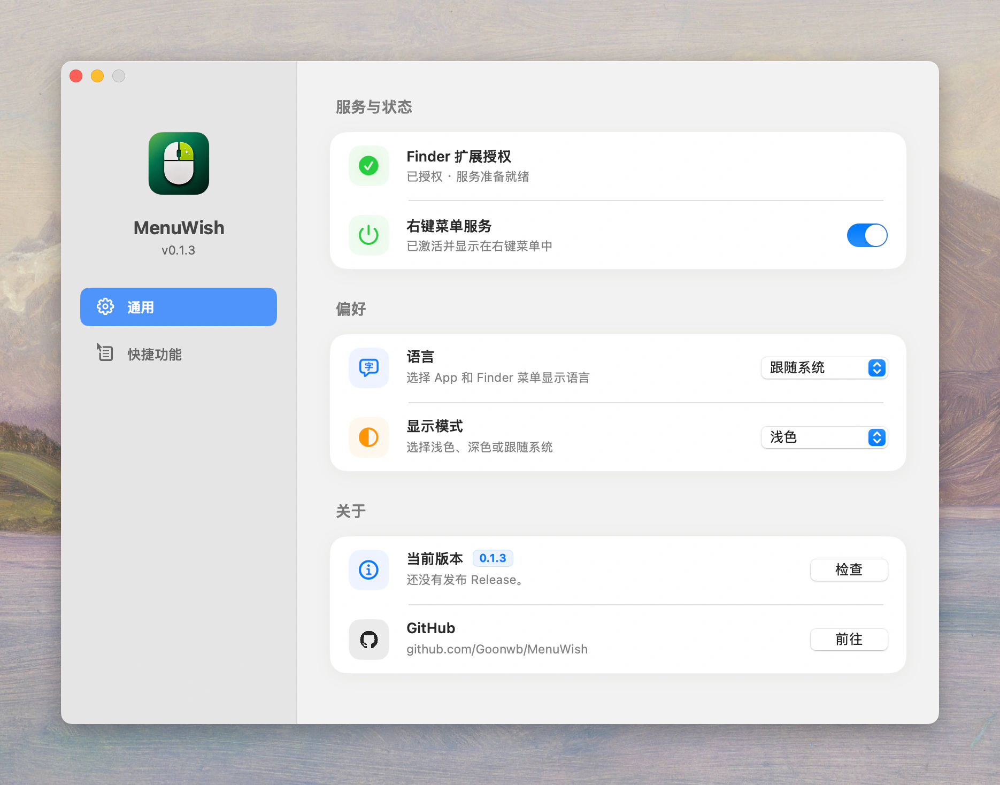
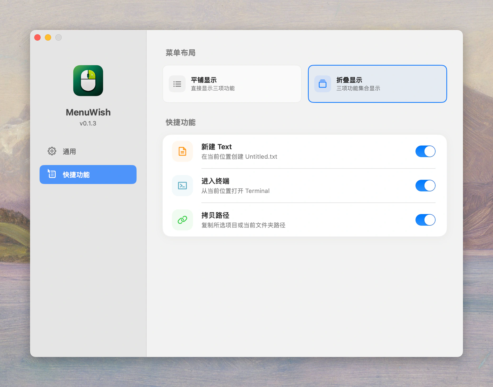

<p align="center">
  
</p>

<h1 align="center">MenuWish</h1>

<p align="center">
  <strong>Make your Finder right-click as you wish.</strong>
</p>

<p align="center">
  轻量开源的 Mac Finder 菜单增强：新建文本、进入终端、拷贝路径。
</p>

<p align="center">
  <strong>English:</strong> A lightweight macOS extension for New Text, Terminal &amp; Copy Path.
</p>

<p align="center">
  <a href="README.md">English</a>
  |
  <a href="README.zh-CN.md">中文</a>
</p>

<p align="center">
  <a href="LICENSE">MIT License</a>
  ·
  <a href="https://github.com/Goonwb">作者</a>
</p>

## 为什么做 MenuWish？

macOS Finder 原生右键菜单没有直接的**新建文本文件**功能，在当前文件夹打开终端或复制完整路径也往往需要额外操作。MenuWish 通过原生 Finder Sync 扩展，把这三个高频操作直接放进 Mac 右键菜单。

## 功能

MenuWish 专注给 Finder 右键菜单补上三项高频小动作：

- **新建 Text**：在当前 Finder 文件夹创建空白 `Untitled.txt`，重名时自动追加编号。
- **进入终端**：在当前 Finder 位置打开 Terminal。
- **拷贝路径**：复制所选项目路径；未选择文件时复制当前文件夹路径。

App 内支持：

- 总开关：启用或停用整个 Finder 右键菜单。
- 子功能开关：单独启用或停用三项功能。
- 折叠显示：将三项功能收进一个子菜单。
- 版本检查：从 GitHub Releases 手动检查最新版本。
- 语言：跟随系统，支持简体中文、繁体中文和 English。
- 外观：跟随系统、浅色或深色模式。

## 界面预览

<p align="center">
  
</p>

<p align="center">
  
</p>

## 系统要求

- macOS 13.0 或更高版本
- 如需从源码编译，需要 Xcode 15 或更高版本

## 从源码安装

```zsh
chmod +x Scripts/install-local.sh
./Scripts/install-local.sh
```

脚本会编译 Release 版本，将 App 复制到 `/Applications`，注册 Finder 扩展并重启 Finder。

## 手动编译

```zsh
xcodebuild \
  -project RightMenuMini.xcodeproj \
  -scheme RightMenuMini \
  -configuration Release \
  -derivedDataPath build \
  build

open build/Build/Products/Release/RightMenuMini.app
```

## 首次授权

MenuWish 使用 Apple 的 Finder Sync 扩展机制。首次使用前需要手动启用扩展：

1. 打开 MenuWish。
2. 点击 **初次授权**。
3. 在 **文件提供程序** 扩展弹窗中启用 **MenuWish**。

未授权时，App 内所有功能开关会显示为关闭并禁用；授权后会恢复默认或已保存的设置。

## 说明

- 当前版本：`0.1.3`。
- 当前分发版本尚未公证。其他用户安装时，可能需要在 macOS 安全设置中手动允许打开。

## 许可证

MenuWish 基于 [MIT License](LICENSE) 开源。
